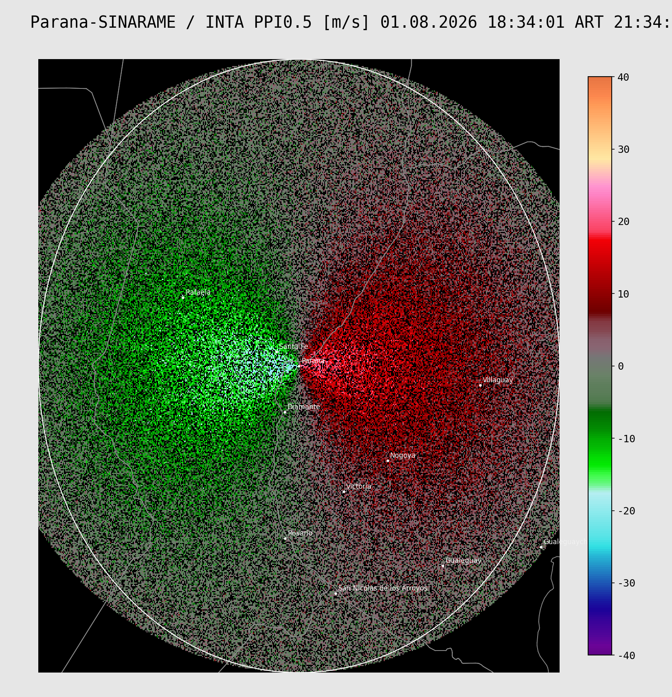

# Radar OHMC — Plots estáticos estilo INTA/SINARAME

Genera imágenes estáticas de radar meteorológico con el mismo estilo visual
que la imagen de referencia (`Paraná-INTA VRAD PPI0.5`): fondo negro,
paleta de color customizable (`.pal`), límites provinciales/departamentales,
etiquetas de ciudad, avisos ACP del SMN en naranja, y título/colorbar en
`DejaVu Sans Mono`. Los datos se traen en vivo de la API real del OHMC
(`webmet.ohmc.ar`): se pide la imagen "grayscale" de cada frame y se
decodifica a valores físicos reales, así que se le puede aplicar
cualquier paleta `.pal` propia (no es el PNG ya coloreado del visor).



## 1) Instalación (miniconda3)

```bash
conda env create -f environment.yml
conda activate radar-ohmc
```

Si preferís pip puro (venv):

```bash
python -m venv .venv
source .venv/bin/activate        # Windows: .venv\Scripts\activate
pip install -r requirements.txt
```

Solo depende de `matplotlib`, `numpy`, `pillow` y `requests` — nada de
GDAL/rasterio, así que no deberías tener problemas de instalación en
ningún sistema operativo.

Abrí la carpeta en VSCode y seleccioná el intérprete `radar-ohmc` (paleta
de comandos → *Python: Select Interpreter*).

## 2) Probar el estilo sin pegarle a la API

```bash
python plot_radar.py --demo
```

Genera un PNG en `output/` con datos sintéticos, para validar el estilo
(colores, fuentes, límites, colorbar, ACP) sin depender de la red.

## 3) La API real del OHMC (ya integrada)

Base: `https://webmet.ohmc.ar/api/v1`

| Endpoint | Para qué sirve |
|---|---|
| `GET /cogs?radar_code=...&product_key=...` | listar frames disponibles |
| `GET /cogs/latest?radar_code=...&product_key=...&vol_nr=...&strategy=...` | el frame más reciente |
| `GET /colormap/info/{product_key}?colormap=...` | colormap oficial (256 colores + ticks); `colormap` acepta `grc_th`, `grc_th2`, `grc_rain`, `grc_g`, `grayscale` |
| `GET /frames/{id}/image.png?colormap=...` | la imagen de ese frame, en el colormap que pidas |

Cada registro de `/cogs` trae `id` (el mismo id que usa `/frames/{id}/...`),
`bbox`, `data_min`/`data_max` (rango real de ese frame puntual),
`cog_vmin`/`cog_vmax` (rango oficial y estable del producto),
`radar_coverage_m`, `elevation_angle`, etc.

**Cómo se obtienen los valores físicos reales** (el OHMC no expone
descarga directa de GeoTIFF/raw): se pide la imagen del frame con
`colormap=grayscale`:

```
https://webmet.ohmc.ar/api/v1/frames/1712492/image.png?colormap=grayscale
```

El nivel de gris de cada píxel (0-255) es una codificación **lineal**
del valor físico real entre `cog_vmin` y `cog_vmax`:

```
valor = cog_vmin + (cog_vmax - cog_vmin) * (gris / 255)
```

Esto se decodifica en `radarplot/ohmc_client.py` (`decode_grayscale_image`)
y da exactamente lo mismo que tener el dato crudo — sin necesidad de
GDAL/rasterio ni de pelearte con GeoTIFF. Podés verificar que la
decodificación da valores sensatos con:

```bash
python diagnose.py --radar RMA1 --product DBZH
```

(compara el min/max decodificado contra `data_min`/`data_max` que
documenta el propio backend para ese frame — si están cerca, todo bien).

Radar y producto se configuran en `config.py` (`RADAR_CODE`,
`PRODUCT_KEY`) o se pasan por línea de comandos:

```bash
# ultimo frame de reflectividad de Cordoba
python plot_radar.py --live --radar RMA1 --product DBZH

# ultimo frame de velocidad Doppler de Termas de Rio Hondo
python plot_radar.py --live --radar RMA11 --product VRADo

# ver que frames/productos hay disponibles para un radar (debug)
python plot_radar.py --list --radar RMA1
```

El título, la unidad y el alcance del anillo blanco se arman solos a
partir de los metadatos que devuelve la API (`radarplot/title.py` +
`radarplot/ohmc_client.py`). Para que el título muestre el nombre de la
localidad en vez del código (`RMA1` → `Córdoba`), completá el
diccionario `RADAR_NAMES` en `config.py`.

## 4) Paletas de color `.pal` customizadas

Se incluyen dos paletas de ejemplo en `palettes/`:

- `VRAD_default.pal` — extraída por muestreo de la imagen de referencia
  que enviaste (velocidad radial Doppler, -40 a 40 m/s).
- `dBZ_default.pal` — paleta clásica de reflectividad.

Formato soportado (compatible con exports simples de WXTools.org):

```
Product: VRAD
Units: m/s
Min: -40
Max: 40
Color: -40.00 96 3 135
Color: -38.85 108 4 152
...
```

También soporta el formato `Color4:` (dos colores por línea, estilo
GR2Analyst) para definir gradientes por tramo. Ver
`radarplot/pal_parser.py` para el detalle completo.

Para usar tu propia paleta:

```bash
python plot_radar.py --live --pal palettes/mi_paleta.pal
```

Agregá `--discrete` si tu paleta es "a bandas" (colores escalonados) en
vez de degradé continuo.

**Bonus**: podés exportar cualquiera de los colormaps oficiales del
OHMC como punto de partida:

```python
from radarplot.ohmc_client import colormap_info_to_pal
colormap_info_to_pal("COLMAX", colormap="grc_th", out_path="palettes/ohmc_grc_th.pal")
```

## 5) Avisos a Muy Corto Plazo (ACP)

Se descargan automáticamente desde el feed CAP público del SMN:

```
https://ssl.smn.gob.ar/feeds/CAP/avisocortoplazo/rss_acpCAP.xml
```

Se dibujan en naranja amarillento (`#f5a623`), línea fina, con el
recuadro *"Avisos Meteorológicos a Muy Corto Plazo"* estilo INTA en la
esquina inferior izquierda (solo aparece si hay avisos vigentes). Para
desactivarlos: `python plot_radar.py --live --no-acp`.

## 6) Límites geográficos

- `data/ar.json` — límites provinciales (23 provincias + CABA).
- `data/departamentos.geojson` — límites departamentales (529 deptos,
  con referencia a su provincia).

El script filtra automáticamente los departamentos a las provincias
dentro del alcance del radar (`radarplot.boundaries.provinces_near`)
para no cargar el país entero en cada render.

## 7) Ciudades

`data/ciudades.csv` trae un listado inicial (Entre Ríos / Santa Fe /
Corrientes). Agregá filas `nombre,lon,lat` para sumar más localidades.

## 8) Todo lo editable está en `config.py`

Radar (código, alcance, nombre/organismo), producto, paleta por
defecto, colores de estilo, tamaños de fuente, candidatos de URL de
descarga del `.tif`, URL del feed ACP, etc.

## Estructura del proyecto

```
radar_ohmc/
├── config.py                 # configuración central
├── plot_radar.py             # script principal (CLI)
├── environment.yml           # entorno conda
├── requirements.txt          # alternativa pip
├── data/
│   ├── ar.json                 # límites provinciales (provisto)
│   ├── departamentos.geojson   # límites departamentales (provisto)
│   └── ciudades.csv            # etiquetas de ciudad
├── palettes/
│   ├── VRAD_default.pal        # paleta velocidad (extraída de tu imagen)
│   └── dBZ_default.pal         # paleta reflectividad de ejemplo
├── radarplot/
│   ├── pal_parser.py           # lector de paletas .pal
│   ├── boundaries.py           # dibujo de límites geojson
│   ├── acp_smn.py               # descarga/parseo de ACP (CAP/SMN)
│   ├── ohmc_client.py           # cliente de la API real de OHMC
│   └── title.py                 # armado del título (ART/UTC)
└── output/                    # PNG generados
```
